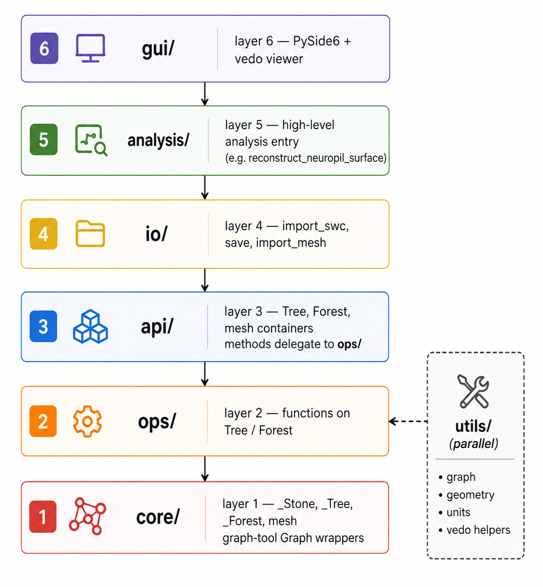

# Architecture

NeuRosetta is organised in strict layers. **User code should import from the
top** (`neurosetta`, `neurosetta.io`, `neurosetta.gui`) and avoid reaching into
`core/` or `utils/` unless you are extending the library.

This page is the map. {doc}`extending_nr` shows how to hang custom analysis off
it (user-level properties) and how to add a first-class library op
(`utils` → `ops` → `api`).

## Why layers

Connectomics morphologies are just directed trees plus metadata, but the
toolbox also does units, batch forests, vedo plots, neuropil surfaces, and a Qt
GUI. Without a layer model those concerns tangle fast.

The rule of thumb:

| You want to… | Touch |
|--------------|--------|
| Analyse / plot / edit neurons in a script | `import neurosetta as nr` |
| Add a one-off metric for your project | Bind a property / use `Forest.apply` — {doc}`extending_nr` |
| Add a reusable metric to the package | `utils/` → `ops/` → `api/` bind |
| Change file formats | `io/` |
| Change the desktop app | `gui/` (still call `ops/`, never invent parallel graph logic) |

## Layer diagram



Data flows **down** on every operation: an `api.Tree` method calls an `ops/`
function, which pulls what it needs from `utils/` and mutates or reads the
`core._Tree.graph` object.

### Concrete call chain

```text
tree.count_nodes()
  → ops.tree_graphs.count_nodes(tree)      # knows about _Tree
    → utils.graph_utils.count_vertices(g)  # only sees graph_tool.Graph
```

```python
import neurosetta as nr

tree = nr.load_example_data(nr.example_ids[0])
assert tree.count_nodes() == nr.count_nodes(tree)  # method ≡ functional API
```

`ops/` adds the `_Tree` type hint, NeuRosetta docstring, and any
pre/post-processing (ensure `Path_length` exists, update `isReduced`, …).
`utils/` does the graph-tool / numpy work and must stay ignorant of `Tree`.

## On-disk layout

Under `src/neurosetta/`:

```text
neurosetta/
├── __init__.py          # public re-exports
├── api/                 # Tree, Forest, mesh classes, describe helpers
├── core/                # _Stone, _Tree, _Forest, mesh bases (slotted)
├── ops/
│   ├── tree_graphs/     # per-tree morphology ops
│   ├── forest_ops/      # whole-forest geometry
│   ├── plotting/        # 2D / 3D / Viewer
│   ├── units/           # set / convert / harmonise
│   └── neuropils/       # mesh distances
├── utils/
│   ├── graph_utils/     # raw Graph helpers
│   ├── geometry_utils/  # linear algebra, PCA, …
│   ├── units/           # Pint registry
│   ├── vedo_utils/      # mesh helpers
│   └── metrics/         # describe() registry + tables
├── io/                  # SWC, NR, mesh
├── analysis/            # composed pipelines
├── gui/                 # Qt + vedo app
├── config/              # package defaults / OpenMP knobs
└── testing/             # synthetic trees, shared fixtures
```

## Layer 1: `core/`

Internal graph containers. Not part of the public import surface, but important
to understand.

| Module | Role |
|--------|------|
| `core/stone.py` | `_Stone` — shared `ID` + `metadata` base (slotted) |
| `core/tree.py` | `_Tree` — single directed tree; `ID` / `metadata` are **graph properties** on `graph.gp` |
| `core/forest.py` | `_Forest` — ordered list of `_Tree` objects + batch helpers |
| `core/mesh.py` | Base for vedo mesh wrappers |

`_Tree` is the object every `ops/` function actually receives (the public
{class}`~neurosetta.api.Tree` subclasses it and adds bound methods).

Because of `__slots__`, you cannot stick arbitrary attributes on a `Tree`
instance (`tree.foo = …` fails). Put custom data in **metadata** or **graph
properties** — see {doc}`../tutorials/tree_basics` and {doc}`extending_nr`.

Property access lives on `_Tree`:

| Method | Purpose |
|--------|---------|
| `list_properties` / `has_property` | Discover bound graph properties |
| `get_property` / `set_property` | Read / write `v` / `e` / `g` maps |
| `get_meta` / `set_meta` / `del_meta` | Metadata dict (some keys protected) |

## Layer 2: `ops/` vs `utils/`

This is the main split to internalise.

### `ops/` — operations on NeuRosetta objects

Functions take a `Tree`, `Forest`, or mesh container as their first argument.
They know about metadata, units, and NeuRosetta conventions (root indexing,
`isReduced`, cable length property names, etc.).

| Subpackage | Purpose |
|------------|---------|
| `ops/tree_graphs/` | Counting, indices, coordinates, traversals, editing, subtrees, path lengths, shape fitting |
| `ops/forest_ops/` | **Forest-wide** geometry — align/rotate/scale all trees together, forest PCA, convex hull |
| `ops/plotting/` | `show_2d`, `show_3d`, dendrogram, {class}`~neurosetta.ops.plotting.Viewer` |
| `ops/neuropils/` | Point-to-surface distances on neuropil meshes |
| `ops/units/` | `set_units`, `convert_units`, forest harmonisation — updates tree metadata **and** coordinates |

Most `Tree` methods are binds of `ops/tree_graphs` functions. A smaller set
(forest alignment, etc.) comes from `ops/forest_ops`.

Typical `ops/tree_graphs` module pattern (see `tree_counting.py`):

```python
from ...core import _Tree
from ...utils.graph_utils import count_vertices as _count_vertices
from .._doc_helpers import enrich_tree_graph_docstrings

def count_nodes(tree: _Tree) -> int:
    """Count the number of nodes in the tree."""
    return _count_vertices(tree.graph)

enrich_tree_graph_docstrings(globals())
```

`enrich_tree_graph_docstrings` stitches See Also links to the matching
`Tree` / `Forest` methods (including name aliases like `reduce_tree` →
`get_reduced_tree`).

### `utils/` — stateless helpers on graphs and arrays

Functions work on raw `graph_tool.Graph` objects, numpy arrays, or Pint units.
They have **no** knowledge of the `Tree` class.

| Subpackage | Purpose |
|------------|---------|
| `utils/graph_utils/` | Property bind/get/set, traversals, vertex indices, counting, subgraph editing |
| `utils/geometry_utils/` | Linear algebra, rotations, PCA, projections, tolerances |
| `utils/units/` | Pint registry, alias normalisation, voxel specs, coordinate rescaling |
| `utils/vedo_utils/` | Mesh distance / shape helpers used by plotting and neuropil ops |
| `utils/metrics/` | Metric registry + {func}`~neurosetta.describe` orchestration (tables, not new algorithms) |

```{note}
When adding a new tree metric: implement the graph logic in `utils/graph_utils/`
(or `utils/geometry_utils/` if purely numeric), wrap it in `ops/tree_graphs/`,
then bind it onto `api/tree_class.Tree` and optionally re-export from
`neurosetta.__init__`. Register it in `utils/metrics/registry.py` if it should
appear in {func}`~neurosetta.describe` / the metrics reference.
```

### `ops/forest_ops/` vs `Forest.apply`

Easy to confuse — they solve different problems:

| Mechanism | What it does |
|-----------|-------------|
| `Forest.apply(fn)` | Run a **per-tree** function on every member (optionally parallel). `forest.count_nodes()` is implemented this way. |
| `ops/forest_ops/*` | Operate on the **entire forest as one geometric object** — e.g. rotate all trees around a shared axis, PCA of pooled coordinates. |

## Layer 3: `api/`

Thin user-facing classes:

- {class}`~neurosetta.api.Tree` — binds ~all tree ops + plotting + units ({doc}`../api/tree`, {doc}`../api/tree_ops/index`)
- {class}`~neurosetta.api.Forest` — per-tree batch binds + `filter`, `apply`, parallel I/O ({doc}`../api/forest`)
- Mesh classes — `Tree_mesh`, `Forest_mesh`, `Neuropil`, `Neuropils`

### How methods get onto `Tree`

No metaclass magic — assignments in `api/tree_class.py`:

```python
from ..ops.tree_graphs import count_nodes, reduce_tree, …

class Tree(_Tree):
    count_nodes = count_nodes
    get_reduced_tree = reduce_tree   # rename via alias
    …
```

So `tree.count_nodes()` is literally the same function object as
`nr.count_nodes(tree)`.

### How methods get onto `Forest`

`_forest_op(fn)` wraps an op so `forest.count_nodes()` becomes
`forest.apply(count_nodes, …)` with shared kwargs (`parallel`, `max_workers`,
`show_progress`, `bind`, …). Some ops also accept `global_=True` when a
forest-wide implementation exists (`global_fn=`).

```python
# api/forest_class.py (sketch)
count_nodes = _forest_op(count_nodes)
```

Name aliases (`reduce_tree` → `get_reduced_tree`, etc.) live in
`ops/_doc_helpers.py` (`TREE_METHOD_ALIASES` / `FOREST_METHOD_ALIASES`).

Import as:

```python
import neurosetta as nr
tree = nr.load_example_data(nr.example_ids[0])
forest = nr.load_example_data()
```

## Layer 4: `io/`

File ↔ object conversion. Returns `api/` instances, never raw graphs.

| Module | Exports |
|--------|---------|
| `io/swc_utils.py` | `import_swc`, `export_swc` |
| `io/nr_utils.py` | `save`, `load` (graph-tool `.gt` wrapper) |
| `io/mesh_utils.py` | `import_mesh`, `export_mesh` |

Single file → `Tree` / mesh object. Directory → `Forest` / mesh collection.

`.nr` preserves bound graph properties and metadata — preferred for NeuRosetta
workflows. SWC is the exchange format. Details: {doc}`../getting_started/io`.

## Layer 5: `analysis/`

High-level routines composed from `ops/` + `utils/`. Kept separate so the core
tree API stays general-purpose.

Example: {func}`~neurosetta.reconstruct_neuropil_surface` pools forest
coordinates, voxelises, runs marching cubes, returns a `Neuropil`.

{func}`~neurosetta.describe` sits adjacent in spirit (orchestration over the
metric registry in `utils/metrics/`) — it does **not** invent new morphometrics;
it tables existing `Tree` / `Forest` methods. See {doc}`../reference/metrics`.

## Layer 6: `gui/`

Desktop app (`run_neuro_GUI` / `nr.start_GUI()`). Subpackages:

| Subpackage | Role |
|------------|------|
| `gui/core/` | Application lifecycle |
| `gui/file_io/` | Load/save dialogs wrapping `io/` |
| `gui/rendering/` | vedo/VTK scene + point picking |
| `gui/tools/` | Reroot, subtree extraction — calls same ops as the library |
| `gui/ui/` | Qt widgets, scale bar overlay |

The GUI never bypasses `ops/`; it is a front-end over the same stack.
Walkthrough: {doc}`../tutorials/gui`.

## Public import surface

What `import neurosetta as nr` re-exports (see {doc}`../api/package`):

| Category | Examples |
|----------|----------|
| Classes | `Tree`, `Forest`, mesh containers |
| I/O | `import_swc`, `save`, `import_mesh`, `load_example_data`, … |
| Tree ops (functional) | `count_nodes`, `reduce_tree`, `get_node_coordinates`, … |
| Plotting | `Viewer`, `plot_2d`, `plot_3d` |
| Units | `set_units`, `convert_units`, `harmonize_forest_units` |
| Analysis / descriptors | `reconstruct_neuropil_surface`, `describe`, … |
| GUI | `start_GUI` |

Functional tree ops are re-exported for scripting convenience; methods on
`Tree` / `Forest` are equivalent.

## Dependency direction (rules)

```
gui, analysis  →  io, api  →  ops  →  utils  →  core  →  graph-tool
```

- **`utils/` must not import from `ops/` or `api/`**
- **`ops/` may import `core/` and `utils/`**
- **`api/` may import `core/` and `ops/`**
- **`io/` builds `api/` objects via `core/` constructors**
- **`gui/` and `analysis/` call `ops/` / `io/` — they do not reimplement graph logic**

These rules keep the graph layer testable without pulling in plotting or Qt.

### Where tests live

| Concern | Typical location |
|---------|------------------|
| Pure graph / geometry helpers | `tests/test_utils/…` |
| Ops + Tree/Forest behaviour | `tests/test_ops/…`, `tests/test_api/…` |
| I/O round-trips | `tests/test_io/…` |
| Synthetic morphologies | `neurosetta.testing` |

Prefer constructing small graphs via `neurosetta.testing` over loading full
FlyWire examples when asserting topology.

## Common pitfalls

1. **Importing `utils/` from user scripts** — works, but you lose units /
   metadata / `bind` conventions. Prefer `Tree` methods or `ops/`.
2. **`inplace=False` on reduce / reroot** — returns a bare `graph_tool.Graph`,
   not a `Tree`. See {doc}`../tutorials/tree_surgery`.
3. **Stashing state on the instance** — `__slots__` blocks it; use properties /
   metadata.
4. **Duplicating logic in the GUI** — always call the same op the library uses.
5. **Forgetting Forest batch kwargs** — `parallel`, `bind`, `show_progress` are
   injected by `_forest_op`; per-tree ops should accept what they need via
   `**kwargs` / explicit parameters so batching stays clean.

## Related reading

- {doc}`../getting_started/overview` — objects, file formats, workflows
- {doc}`../tutorials/tree_basics` — graph properties in practice
- {doc}`extending_nr` — user-level and library extension patterns
- {doc}`../reference/metrics` — descriptor registry / `describe`
- {doc}`../api/index` — generated API reference
